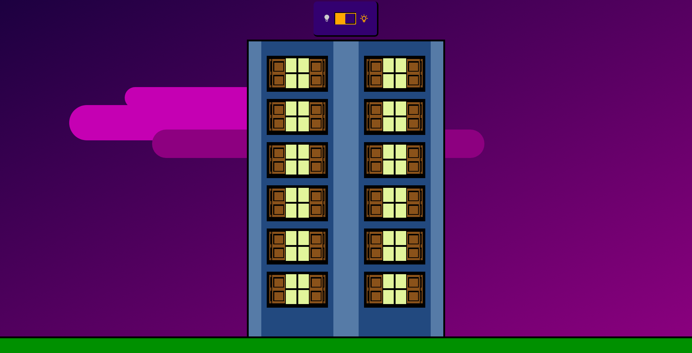

# Lighted Window

O projeto consiste em uma cena simples com um prédio e 12 janelas, nas quais os usuários podem interagir para ligar e desligar a luz.

## Rodando o projeto para desenvolvimento

A seguir instruções para executar o projeto em modo desenvolvimento.

### Usando npm

primeiro é necessário instalar as dependências utilizando o comando `npm i`

para executar o projeto utilize o comando `npm start` ou o comando `npm run dev`.

Após isto a aplicação será iniciada na url: http://localhost:3000/

### Usando o docker

Para executar a aplicação utilizando o docker bastar executar o comando `docker-compose up`

Após isto a aplicação será iniciada na url: http://localhost:3000/

## Build do projeto

O build do projeto pode ser realizado utilizando o comando `npm run build` e todos os arquivos gerados serão armazenados dentro da pasta `dist/`

## Executando em modo de produção

Para executar facilmente o projeto em modo de produção pode utilizar a imagem hospedada no docker-hub:

`docker container run -p 3000:3000 igornfaustino/lighted-window`

Caso deseje executar de forma manual, utilize os arquivos dentro da pasta `dist/`

## Funcionamento

O projeto consiste em um prédio o qual o usuário pode interagir apagando e ligando as janelas. Para fazer isto basta dar um click na janela que deseje apagar ou acender a luz.

Janela com a luz acessa:

Janela com a luz apagada:

O usuário também pode interagir com um interruptor de luz, o qual liga e desliga todas as luzes do prédio de uma única vez!

## Modo noturno

A aplicação possui dois modos definido pelo horário atual da sua localidade. Para isto aplicação consulta a [Sunrise Sunset API](https://sunrise-sunset.org/api) utilizando as informações de localização do navegador assim que ela é iniciada.

## Componentes

### Scene

Componente que envolve todos os outros. O papel deste componente é definir elementos do cenário.

#### Props

- **children** (`JSX.Element | JSX.Element[]`): Elementos para serem posicionados no cenário

---

### Building

Componente que desenha o prédio e posiciona todas as janelas no devido lugar.

#### Props

- **numberOfWindows** (`number`): Quantidade de janelas presentes no prédio

---

### Window

Componente que desenha a janela e controla seu estado de acessa ou apagada

---

### Light Switch Button

Componente responsável por estilizar o checkbox em formato de interruptor

#### Props

- **onChange** (`function`): Função disparada em cada evento `change`
- **checked** (`boolean`): Valor checked passado para o checkbox

---

## Controle de estado

O controle das informações globais do aplicativo foram realizados utilizando a `Context API`, e foram utilizados 2 contextos diferentes:

- **NightModeContext**: Responsável por informar se o aplicativo está em modo noturno
- **AllLightsContext**: Responsável por informar o valor do interruptor que controla todas as luzes do prédio
